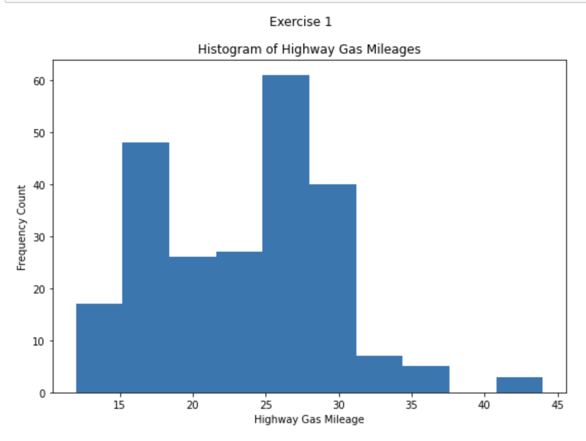

# Exercise 1

## Showing A Distributions
- Using the `mpg` dataset, create a histogram that shows a frequency plot for all of the highway gas mileages.

## Attention to Detail
- Be sure to title your plot "Histogram of Highway Mileages"
- Label the x axis to be "highway gas mileages"
- Label the y axis "frequency"

## Expected Output
Depending on your plotting library/platform, your output should look similar to the image below.
